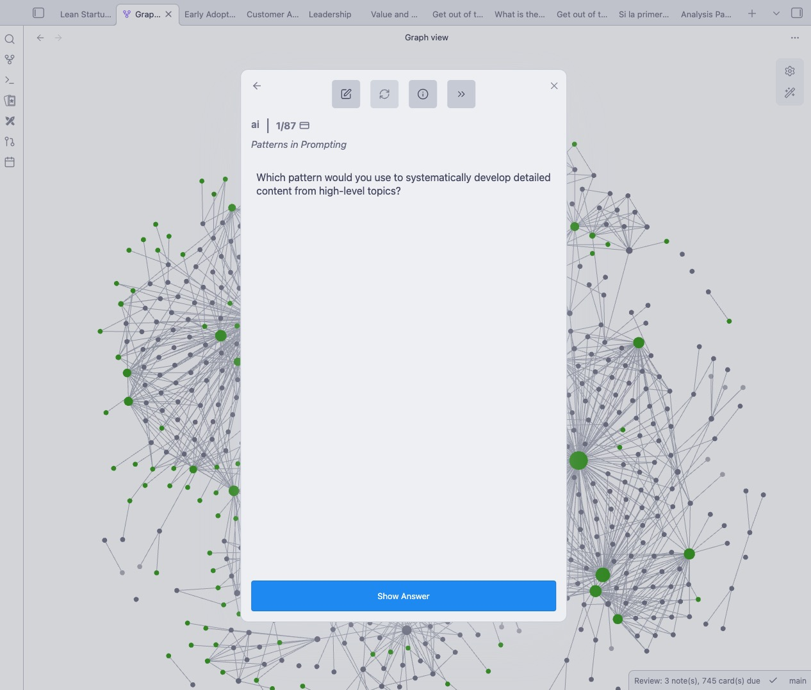
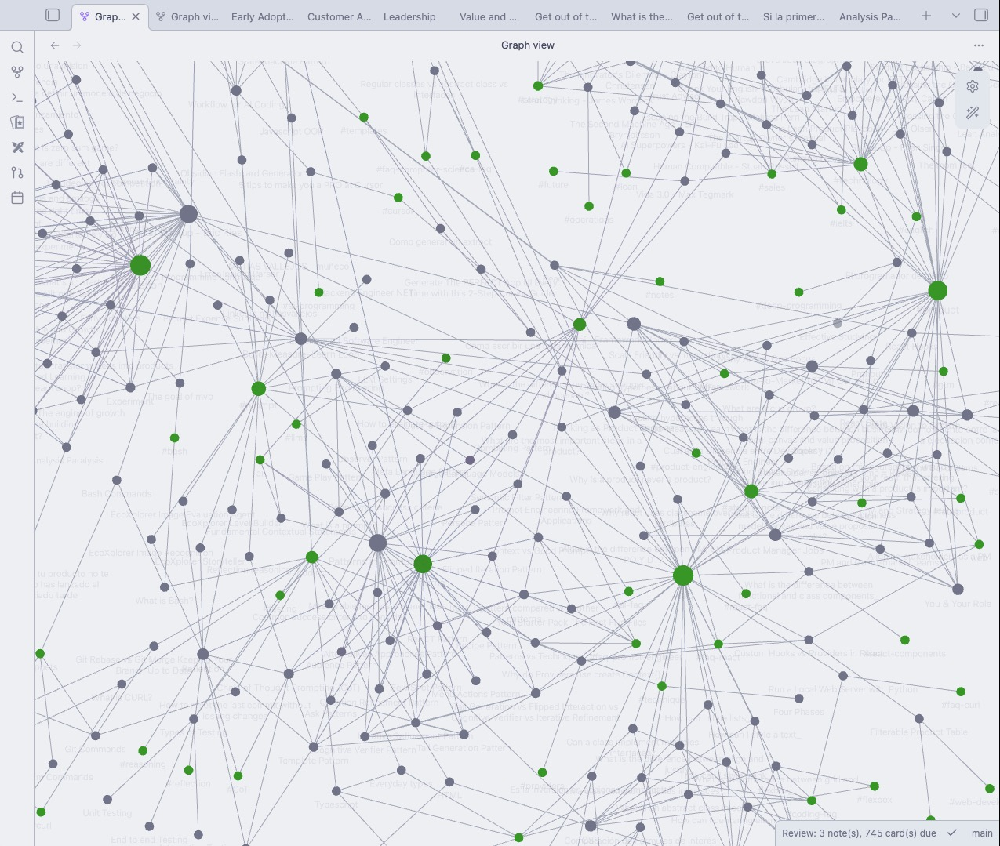
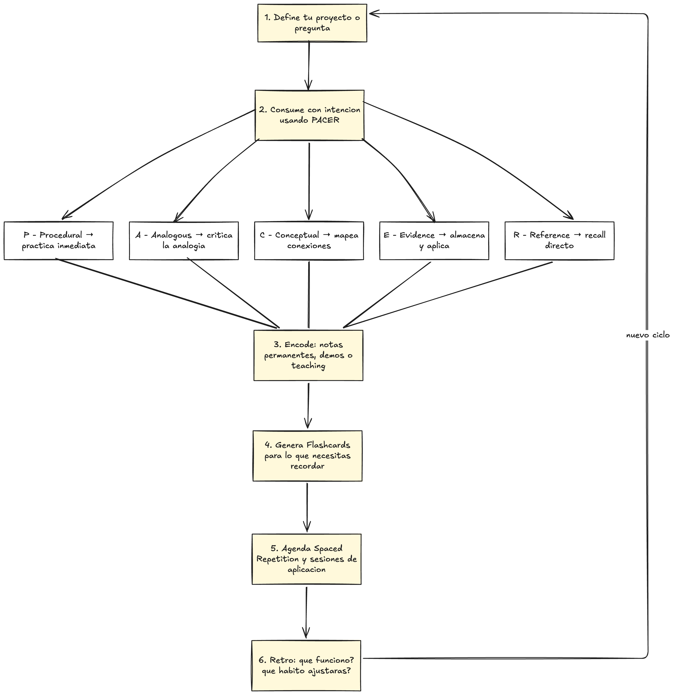

# Learn to Learn — Sistema Completo de Aprendizaje Efectivo

[](https://x.com/mativallej_)

](https://github.com/mativallej/learn-to-learn/network)
](https://github.com/mativallej/learn-to-learn/stargazers)
](https://github.com/mativallej/learn-to-learn/watchers)

> Sistema completo para aprender a aprender: encoding, spaced repetition, flashcards, active reading, study habits y knowledge management con Zettelkasten.




## Introduction

**Learn to Learn** es un sistema de aprendizaje efectivo que conecta tres bucles: deep encoding, spaced repetition y study habits consistentes. Cada pieza alimenta a la otra para convertir informacion en decisiones reales.

**Lo que vas a encontrar:**
- **Encoding** — Reduce la fuga inicial y establece significado desde el minuto cero.
- **Spaced Repetition & Flashcards** — Mantienen viva la memoria con recordatorios disenados por vos.
- **Study Habits** — Protegen bloques de estudio, ensenan y convierten la dificultad en rutina.
- **Note Taking System** — Captura ideas en papel y las migra a tu segundo cerebro.
- **Active Reading** — Define como consumir, digerir y revisar fuentes largas.
- **Knowledge Management** — Zettelkasten como sistema para pensar escribiendo.

Sin deep encoding no existe retrieval estable. Sin spaced repetition no hay retention. Sin study habits no hay consistencia. Este repositorio conecta todo.

## Components

| Component | Description | Doc |
|---|---|---|
| **Encoding** | El momento en que la informacion cruza de working memory a long-term memory | [`docs/encoding.md`](docs/encoding.md) |
| **Spaced Repetition** | Programa repasos cada vez mas espaciados para vencer la Forgetting Curve | [`docs/spaced-repetition.md`](docs/spaced-repetition.md) |
| **Flashcards** | Tarjetas que fuerzan Active Recall y resetean la Forgetting Curve | [`docs/flashcards.md`](docs/flashcards.md) |
| **Study Habits** | Rutinas deliberadas: bloques agendados, deep work y active teaching | [`docs/study-habits.md`](docs/study-habits.md) |
| **Note Taking System** | El cuaderno fisico como laboratorio portatil de pensamiento | [`docs/note-taking-system.md`](docs/note-taking-system.md) |
| **Active Reading** | Protocolo de siete pasos para exprimir un libro | [`docs/how-to-read-a-book.md`](docs/how-to-read-a-book.md) |
| **Retention** | Equilibrar consumo y digestion usando el framework PACER | [`docs/how-to-remember-what-you-read.md`](docs/how-to-remember-what-you-read.md) |
| **Zettelkasten** | Sistema de atomic notes enlazadas para pensar escribiendo | [`docs/zettelkasten.md`](docs/zettelkasten.md) |

## Learning Flow



## Key Data

| Data | Source |
|---|---|
| Sin review olvidamos **~50% en 1 hora**, 70% en 24h, 90% en 1 semana | Ebbinghaus — Forgetting Curve |
| Estudiantes con Spaced Repetition: **70% vs 64%** frente a cramming | University of Leicester (2020) |
| Meta-analisis de **317 estudios** confirma mayor retention con SR | Multiple sources |
| Escribir flashcards a mano activa el **dorsolateral prefrontal cortex** | Cognitive neuroscience |
| Hasta el **90%** de la informacion consumida se pierde sin digestion | Dr. Justin Sung |

## Repository Structure

```
learn-to-learn/
├── docs/
│   ├── encoding.md                        # Deep Encoding
│   ├── spaced-repetition.md               # Spaced Repetition
│   ├── flashcards.md                      # Flashcards & Active Recall
│   ├── study-habits.md                    # Study Habits
│   ├── note-taking-system.md              # Note Taking System
│   ├── how-to-read-a-book.md              # Active Reading (7 steps)
│   ├── how-to-remember-what-you-read.md   # PACER Framework
│   └── zettelkasten.md                    # Knowledge Management System
├── README.md
└── LICENSE
```

## Quick Start

No necesitas instalar nada. Este es un repositorio de conocimiento.

1. **Empieza por el sistema completo**

   Lee [`docs/encoding.md`](docs/encoding.md) para entender por que el deep encoding es la base de todo.

2. **Aprende a consumir informacion**

   [`docs/how-to-read-a-book.md`](docs/how-to-read-a-book.md) y [`docs/how-to-remember-what-you-read.md`](docs/how-to-remember-what-you-read.md) te dan el framework PACER para no perder el 90% de lo que lees.

3. **Construi tu sistema de retention**

   [`docs/spaced-repetition.md`](docs/spaced-repetition.md) + [`docs/flashcards.md`](docs/flashcards.md) para mantener vivo lo que aprendiste.

4. **Protege tu tiempo de estudio**

   [`docs/study-habits.md`](docs/study-habits.md) para convertir todo esto en rutina sostenible.

5. **Organiza tu conocimiento**

   [`docs/note-taking-system.md`](docs/note-taking-system.md) + [`docs/zettelkasten.md`](docs/zettelkasten.md) para que cada idea se conecte con las demas.

## Bibliography

| Resource | Type |
|---|---|
| [David Perell — Note Taking System](https://www.youtube.com/watch?v=tDmjz6HB-yw) | Video |
| [Huberman Lab — Habits of Effective Students](https://www.youtube.com/watch?v=1bszFX_XcbU) | Video |
| [Pablo Lomeli — How to Read a Book](https://www.youtube.com/watch?v=RIb29ENeLgU) | Video |
| [Justin Sung — How to Remember What You Read](https://www.youtube.com/watch?v=okHkUIW46ks) | Video |

## Contributions

Las contribuciones son bienvenidas. Si queres mejorar el contenido, agregar nuevas tecnicas o corregir errores:

1. **Fork** del repositorio.
2. **Crea** una branch (`git checkout -b feature/nueva-tecnica`).
3. **Agrega** tu contenido siguiendo la estructura existente.
4. **Commit** tus cambios (`git commit -m 'Add nueva tecnica de aprendizaje'`).
5. **Push** a la branch (`git push origin feature/nueva-tecnica`).
6. **Abri** un Pull Request.

## Contact

Si tenes preguntas, sugerencias o queres colaborar:

- **Matias Vallejos**
- [matiasvallejos.com](https://matiasvallejos.com)
- [@mativallej_](https://x.com/mativallej_)

## License

Este proyecto es open source bajo la [MIT License](LICENSE).
